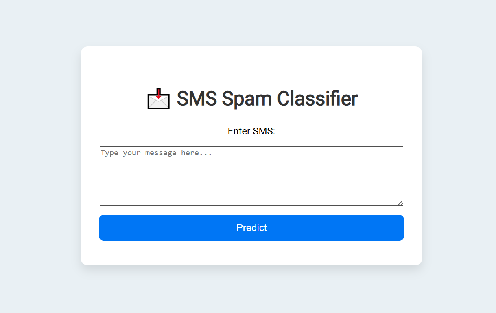

# 📩 SMS Spam Classifier

This is a simple web application built with **Flask** that classifies SMS messages as **Spam** or **Not Spam** using **Natural Language Processing (NLP)** and a **Naive Bayes classifier**.

---

## 🚀 Features

- Classifies SMS messages as spam or not spam
- Clean and user-friendly interface
- Text preprocessing using NLTK (tokenization, stemming, stopwords removal)
- Trained on real-world spam detection dataset
- Built with Flask for the backend

---

## 🖥️ Demo

  

---

## 🛠️ Tech Stack

- **Python 3**
- **Flask**
- **NLTK**
- **Scikit-learn**
- **HTML/CSS**

---

## 🔧 Installation

1. **Clone the repository**  
```bash
git clone https://github.com/itsmeumaima/SMS_Spam_Classifier.git
cd SMS_Spam_Classifier
